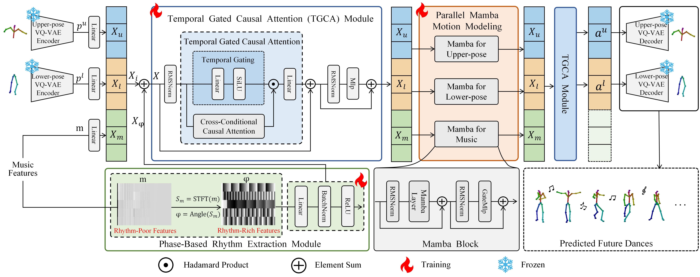

<h2 align="center"> <a href="https://arxiv.org/abs/2503.17340">Align Your Rhythm: Generating Highly Aligned Dance Poses with Gating-Enhanced  <a href="https://arxiv.org/abs/2503.17340"> Rhythm-Aware Feature Representation </a>

<h3 align="center">
  <font color="red"><b> ICCV 2025 Accept </b></font>
</h3>


<h5 align="center">

[](https://arxiv.org/abs/2503.17340) [](https://huggingface.co/datasets/fancongyi/danceba) 
[](https://danceba.github.io/)
</h5>

The code is currently being organized and will be released once the preparation is complete.




## Environment

```
conda create -n danceba python=3.10
conda activate danceba
conda install -c nvidia cuda-nvcc=11.8.89
pip install torch==2.1.1+cu118 torchvision==0.16.1+cu118 torchaudio==2.1.1+cu118 --index-url https://download.pytorch.org/whl/cu118
conda install cudatoolkit=11.8
pip install xformers==0.0.23
pip install numpy==1.26 -i https://pypi.tuna.tsinghua.edu.cn/simple
```

### Mamba Environment
```
wget https://github.com/Dao-AILab/causal-conv1d/releases/download/v1.1.3.post1/causal_conv1d-1.1.3.post1+cu118torch2.1cxx11abiFALSE-cp310-cp310-linux_x86_64.whl
wget https://github.com/state-spaces/mamba/releases/download/v1.1.1/mamba_ssm-1.1.1+cu118torch2.1cxx11abiFALSE-cp310-cp310-linux_x86_64.whl
pip install causal_conv1d-1.1.3.post1+cu118torch2.1cxx11abiFALSE-cp310-cp310-linux_x86_64.whl 
pip install mamba_ssm-1.1.1+cu118torch2.1cxx11abiFALSE-cp310-cp310-linux_x86_64.whl
```


## Data preparation

In our experiments, we use AIST++ for both training and evaluation. You can pre-process the data based on the dataset provided by [Bailando](https://github.com/lisiyao21/Bailando) or use the already processed data we have saved at [huggingface](https://huggingface.co/datasets/fancongyi/danceba).

**Easy to download**
```
### If the download speed is slow
# pip install -U huggingface_hub
# pip install hf_transfer
# export HF_HUB_ENABLE_HF_TRANSFER=1
# export HF_ENDPOINT=https://hf-mirror.com
huggingface-cli download --repo-type dataset --resume-download fancongyi/danceba --local-dir <save_path>
```

**The data and pretrain models are organized in the following format:**
```
  |-experiments
  |  |-cc_motion_gpt
  |  |  |-ckpt
  |  |-sep_vqvae
  |  |  |-ckpt
  |  |-sep_vqvae_root
  |  |  |-ckpt
  |-aist_plusplus_final
  |  |-all_musics
  |  |-keypoints2d
  |  |-splits
  |  |-keypoints3d
  |  |-cameras
  |  |-motions
  |-data
  |  |-astpp_music_feat_60fps
  |  |-aistpp_music_feat_7.5fps
  |  |-aist_features_zero_start
  |  |  |-kinetic_features
  |  |  |-manual_features_new
  |  |-aistpp_test_full_wav
  |  |-aistpp_train_wav
```


## Training

Our models are all trained with single NVIDIA 3090 GPU.

```
# If training, modify configs/cc_motion_gpt.yaml line:20 need_not_train_data: true -> false
sh srun_gpt_all.sh configs/cc_motion_gpt.yaml train 1
```

## Evaluation

### 1. Generate dancing results

To test with our pretrained models, please download the weights from [huggingface](https://huggingface.co/datasets/fancongyi/danceba).

```
sh srun_gpt_all.sh configs/cc_motion_gpt.yaml eval 1
# Due to the optimal weight file being overwritten during training,
# we sincerely apologize and provide an alternative weight file with comparable performance.
```

### 2. Dance quality evaluations

After generating the dance in the above step, run the following codes.

```
# You will get results consistent with this: 
# FID_k:12.92  FID_g:14.38  Div_k:8.24  Div_g:7.44  BAS:0.2902
python utils/metrics_new.py
python utils/beat_align_score.py
```


## Acknowledgement

This work is built on many amazing research works and open-source projects, thanks a lot to all the authors for sharing!

- [Bailando](https://github.com/lisiyao21/Bailando)
- [Mamba](https://github.com/state-spaces/mamba)

## Citation
If you find our work useful in your research, please consider giving a star :star: and citing the following paper :pencil:.

```bibTeX
@article{fan2025align,
      title={Align Your Rhythm: Generating Highly Aligned Dance Poses with Gating-Enhanced Rhythm-Aware Feature Representation},
      author={Fan, Congyi and Guan, Jian and Zhao, Xuanjia and Xu, Dongli and Lin, Youtian and Ye, Tong and Feng, Pengming and Pan, Haiwei},
      journal={arXiv preprint arXiv:2503.17340},
      year={2025}
    }
```
